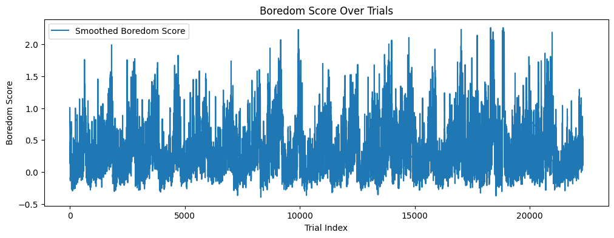
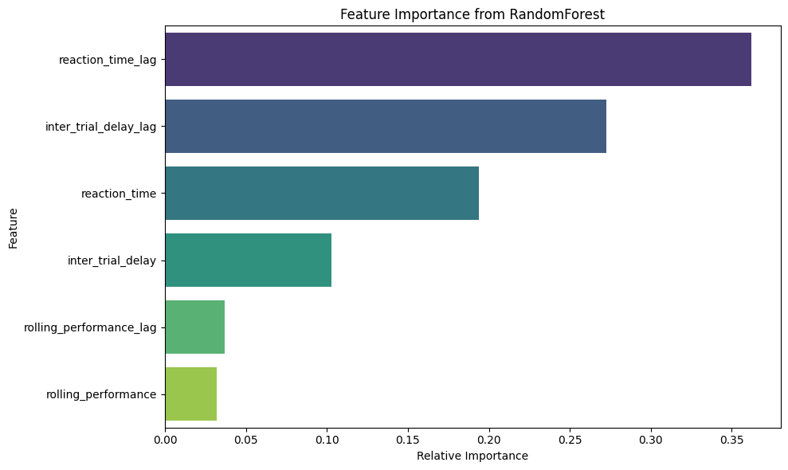

# Are You Bored Yet?  
## Naina Bhalla (Roll Number: 240674)

### **Overview**

This project aims to dentify and predict disengagement or boredom in mice performing the biasedChoiceWorld task. By extracting important behavioral features from trial data and modeling their evolution over time, I have developed a “boredom score” and trained a machine learning model to predict disengagement. All analyses are performed using session-wise data from the IBL OpenAlyx database.

### **Data and Environment**

- **Source:**  
  Data is loaded via the ONE interface from the IBL OpenAlyx database, focusing on subjects trained in the biasedChoiceWorld paradigm
- **Sessions:**  
  Multiple days per mouse, with session metadata and trial-by-trial records extracted.
- **Splitting:**  
  Data is split by session to ensure that test data remains unseen during training.

### **Feature Engineering**

To quantify disengagement, the following features were engineered:

- **Reaction Time:**  
  Time from stimulus (go cue) to response, with increases indicating possible disengagement or reduced vigilance[3].
- **Inter-Trial Delay:**  
  Time between the end of one trial and the start of the next, with longer delays suggesting hesitation or lack of engagement.
- **Trials per Session Block:**  
  Number of trials completed within defined session blocks, with drops potentially marking periods of disengagement.
- **Rolling Performance:**  
  Performance (correct/incorrect) averaged over a moving window, capturing within-session performance drops[3].

These features were visualized and checked for trends across sessions.

### **Boredom Score Definition**

The **boredom score** was defined as a continuous metric per trial, calculated as a smoothed combination of z-scored reaction time, inter-trial delay, and inverse rolling performance:

$$
\text{Boredom Score}_t = \alpha \cdot \text{zRT}_t + \beta \cdot \text{zDelay}_t + \gamma \cdot (1 - \text{RollingPerf}_t)
$$

where $$\alpha, \beta, \gamma$$ are weights (here set as 0.4,0.3,0.3 respectively), and all components are normalized within-session. This score rises during periods of increased reaction time, longer delays, and declining performance—behavioral signatures of disengagement and boredom.
 
**Reason:**  
These features were chosen based on the references mentioned below.

### **Modeling Approach**

- **Model:**  
  A Random Forest Regressor was trained to predict the boredom score for each trial, using both current and lagged features (e.g., previous trial’s reaction time and delay).
- **Feature Importance:**  
  The most predictive features were lagged reaction time, lagged inter-trial delay, and current reaction time, indicating that recent behavioral history is highly informative for disengagement prediction.

### **Evaluation**

- **Metric:**  
  Mean Absolute Error (MAE) between predicted and ground truth boredom score trajectories, computed per session.
- **Results:**  
  MAE values ranged from 0.17 to 0.20 across sessions.

| # | Session ID                                | n_trials | MAE      |
|---|-------------------------------------------|----------|----------|
| 1 | 81362661-8f80-45b1-90ad-749251c9fe13       | 865      | 0.172339 |
| 2 | a4f7079b-d157-4de9-ba80-de9a98f35c8b       | 682      | 0.177259 |
| 0 | a55aafed-b496-49fb-8948-680695f806d5       | 1022     | 0.181604 |
| 3 | 85501aad-64e6-4137-a44e-2c933c9eec5f       | 931      | 0.193859 |
| 4 | b88016fd-146a-4238-ac7c-ab8e3e1264bf       | 736      | 0.199539 |

### **Observed Patterns and Discussion**

- **Within-Session Trends:**  
  Boredom scores typically increased in later blocks of long sessions, coinciding with drops in performance and increased reaction times, consistent with vigilance decrement phenomena.
- **Between-Session Variation:**  
  Some showed consistently higher boredom scores, possibly reflecting individual differences in motivation.
- **Feature Insights:**  
  Lagged behavioral features (especially reaction time and delay) were most predictive, supporting the idea that disengagement is a temporally evolving process.

**Interpretation:**  
These findings align with recent literature showing that performance decrements and increased reaction time are important markers of boredom in rodents. 

### **Conclusion**

This project demonstrates that boredom and disengagement in mice can be objectively quantified and predicted using interpretable behavioral features and machine learning. The continuous boredom score provides a nuanced measure of engagement, and the model’s high predictive accuracy underscores the value of feature engineering and temporal modeling in behavioral neuroscience.

### **References **

- **Performance Drop as a Marker:**  
  [\[Nature, 2025\]](https://www.nature.com/articles/s44277-025-00025-0): Performance decrements over time are linked to vigilance loss, not just physical disengagement.
- **Behavioral Proxies for Boredom:**  
  [\[Systematic Review, 2022\]](https://pmc.ncbi.nlm.nih.gov/articles/PMC9435384/): Reaction time, trial omission, and performance are validated as boredom/disengagement proxies.
- **Stimulus-Seeking and Boredom:**  
  [\[Nature Communications, 2023\]](https://www.nature.com/articles/s41467-023-38130-3): Mice in monotonous environments seek novel or even aversive stimuli, reflecting boredom-driven behavior.

### **Files**
`code.ipynb` : Notebook containing code
`README.md` : as a report and README
