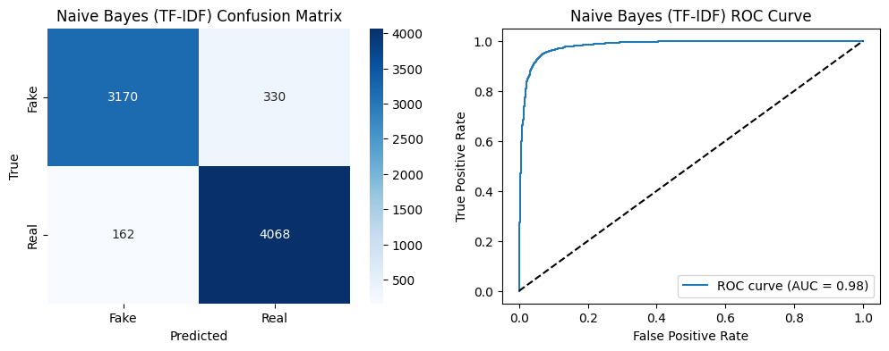
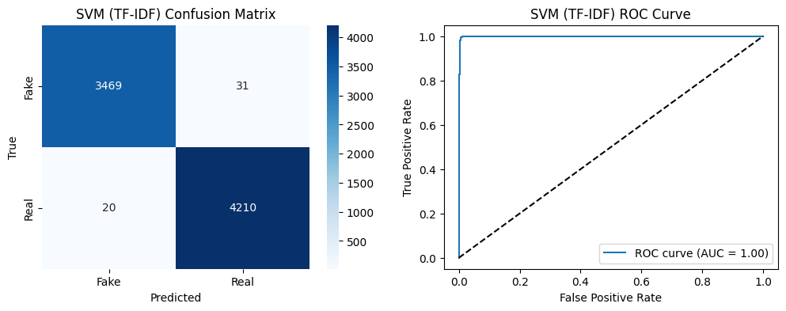

# VeritasVigil

## Process:

1. Loading and combining the datasets
2. Custom Tokenization
3. Rule-Based POS Tagging
4. Lemmatization based on POS tags
5. Feature Extraction  
    a. Bag-of-Words 
    b. TF-IDF  
6. Classification Models: 
Trains and compares Naive Bayes and Linear SVM for detecting fake news.
7. Visualizations
Includes token frequency plots, word clouds, ROC curves, and confusion matrices.

## Evaluation

1. Naive Bayes with Bag of Words

2. Naive Bayes with TF-IDF

3. SVM with Bag of Words

4. SVM with TF-IDF

## 📊 Comparative Analysis

| Model                | Accuracy  | Precision | Recall   | F1-score | ROC AUC  |
|---------------------|-----------|-----------|----------|----------|----------|
| Naive Bayes (BoW)   | 0.946313  | 0.956231  | 0.945154 | 0.950660 | 0.975382 |
| Naive Bayes (TF-IDF)| 0.936352  | 0.924966  | 0.961702 | 0.942976 | 0.981883 |
| SVM (BoW)           | 0.993920  | 0.993861  | 0.995035 | 0.994448 | 0.997948 |
| SVM (TF-IDF)        | 0.993402  | 0.992690  | 0.995272 | 0.993979 | 0.999042 |

## Conclusion
The comparative analysis demonstrates that SVM with TF-IDF features is
the optimal approach for this dataset, achieving the highest accuracy and discrimination.

## Files
1. `code.ipynb` - Notebook cotaining the code
2. `Report.pdf` - Documentation
